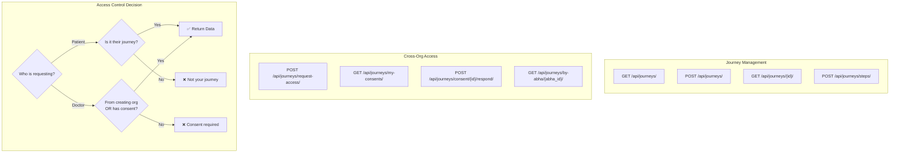
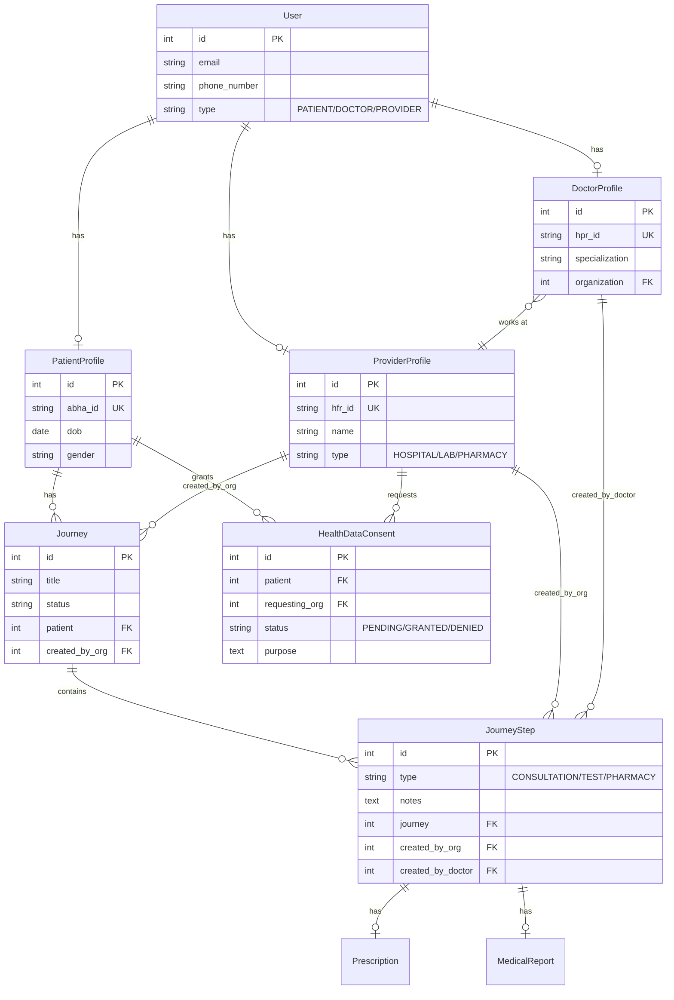
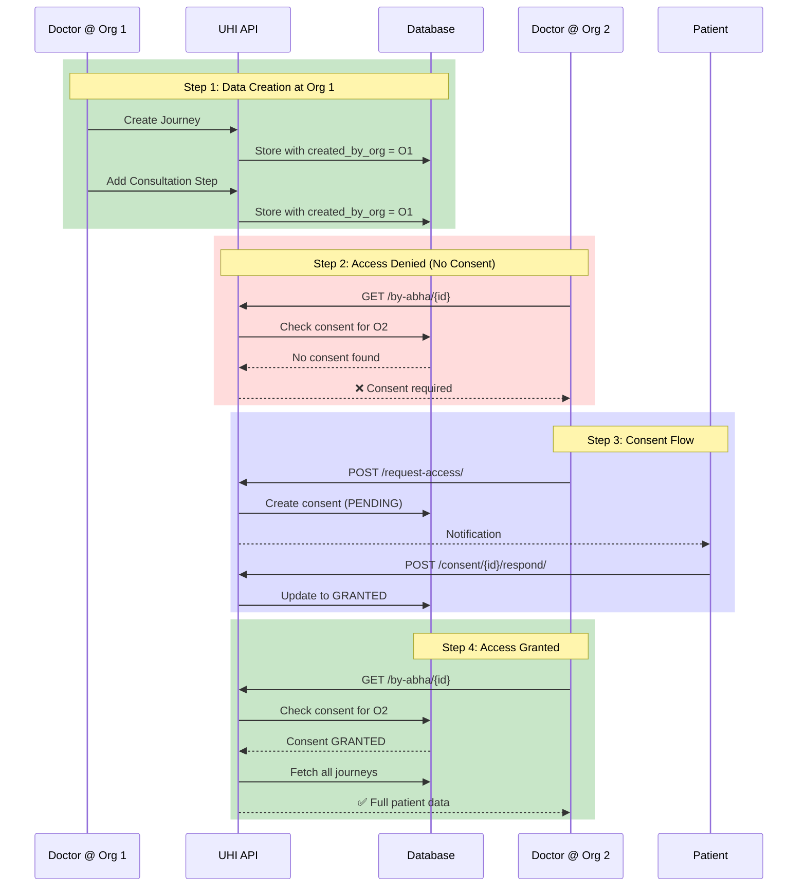
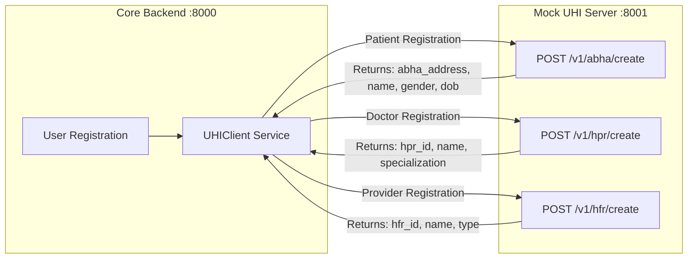

# UHI Platform - Architecture Diagrams

## 1. User Registration APIs

```mermaid
flowchart TB
    subgraph Registration["User Registration Endpoints"]
        direction TB
        
        subgraph Patient["POST /api/auth/register/patient/"]
            P1[Request] --> P2[Create ABHA via Mock]
            P2 --> P3[Create User + PatientProfile]
            P3 --> P4["Returns: email, phone, ABHA ID"]
        end
        
        subgraph Doctor["POST /api/auth/register/doctor/"]
            D1[Request + org_hfr_id] --> D2[Create HPR via Mock]
            D2 --> D3[Create User + DoctorProfile]
            D3 --> D4[Link to Organization]
            D4 --> D5["Returns: email, phone, HPR ID"]
        end
        
        subgraph Provider["POST /api/auth/register/provider/"]
            PR1[Request] --> PR2[Create HFR via Mock]
            PR2 --> PR3[Create User + ProviderProfile]
            PR3 --> PR4["Returns: email, phone, HFR ID"]
        end
    end
    
    subgraph Auth["Authentication"]
        Login["POST /api/auth/login/"] --> JWT["Returns JWT tokens"]
        Refresh["POST /api/auth/token/refresh/"] --> NewJWT["Returns new access token"]
    end
```

---

## 2. Journey APIs Flow

---

## 3. Data Storage Model

---

## 4. Cross-Org Data Access Flow

---

## 5. Mock UHI Server Integration

---

## Exporting Diagrams

You can export these diagrams using:

1. **Mermaid Live Editor**: https://mermaid.live - Paste each mermaid block and export as PNG/SVG
2. **VS Code Extension**: Install "Markdown Preview Mermaid Support" extension
3. **CLI Tool**: `npm install -g @mermaid-js/mermaid-cli` then run `mmdc -i diagrams.md -o output.png`
